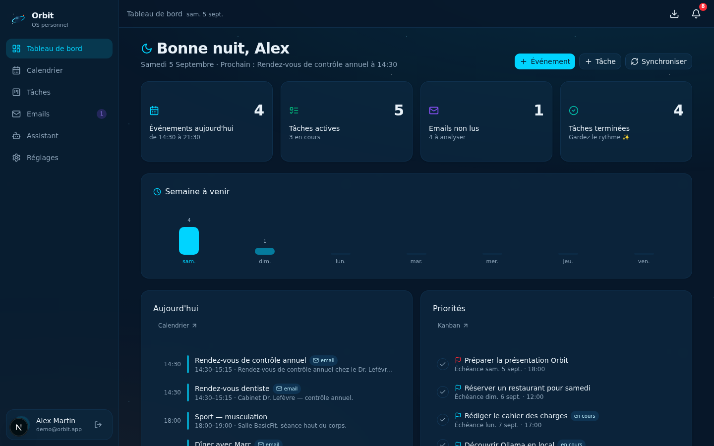
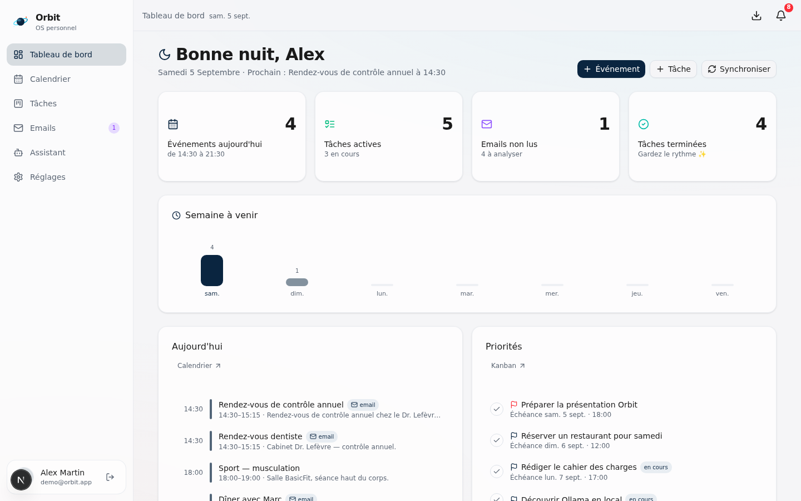
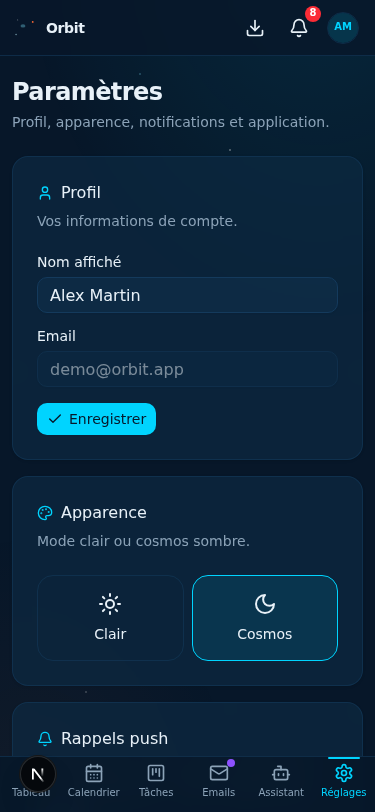
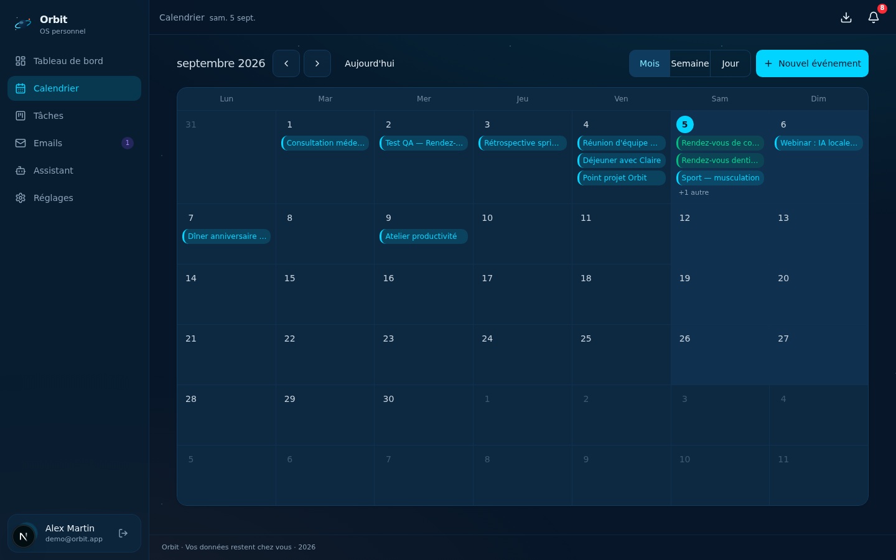
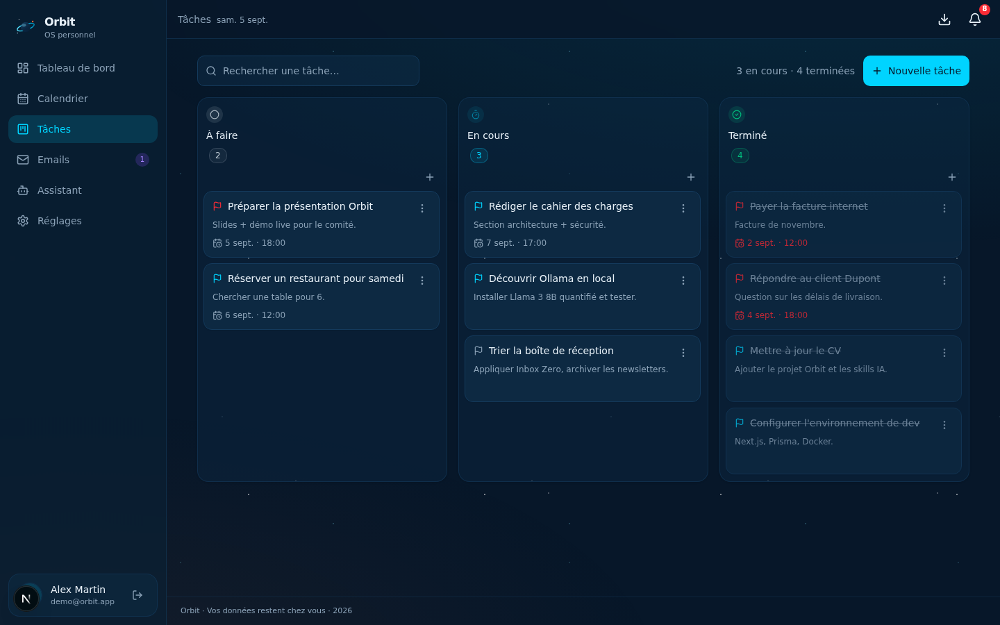
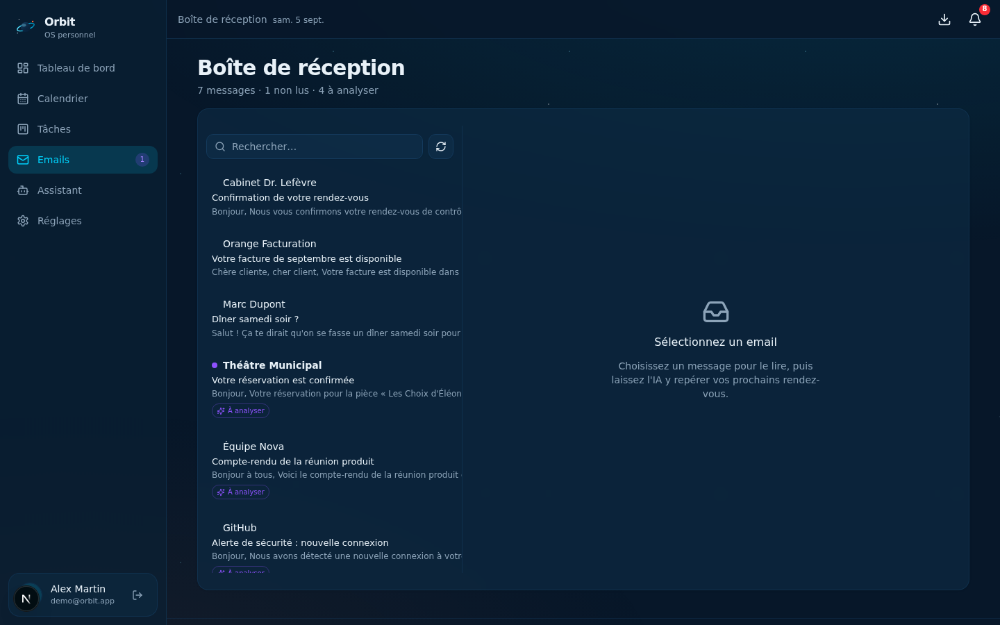

<div align="center">

# 🪐 Orbit

**Votre OS personnel — privé, local, intelligent.**

Calendrier intelligent · Kanban · Boîte mail + IA · Assistant · PWA & notifications push

[](https://nextjs.org) [](https://www.typescriptlang.org) [](https://bun.sh) [](https://www.prisma.io)

</div>

---

Orbit regroupe votre quotidien dans **une seule application installable**, sans cloud :
vos événements, vos tâches, vos emails — analysés par une **IA locale** (Ollama), avec
**rappels push** chiffrés (VAPID) 15 min avant un événement et 1 h avant une échéance.

## ✨ Fonctionnalités

| Module | Détail |
| --- | --- |
| 📅 **Calendrier** | Vues mois / semaine / jour (100 % custom), placement en couloirs, événements issues des emails |
| ✅ **Tâches Kanban** | Drag & drop (dnd-kit), 3 colonnes À faire / En cours / Terminé, priorités, échéances |
| 📧 **Emails + IA** | Extraction d'événements depuis un email (titre, date, durée, confiance) → ajout au calendrier en 1 clic |
| 🤖 **Assistant** | Chat streaming contextualisé sur vos vraies données (agenda, tâches, emails) |
| 🔔 **Push PWA** | Service Worker, web-push VAPID chiffré (aes128gcm), rappels automatiques anti-doublon, purge des appareils morts |
| 🎨 **Design system** | Palette bleu profond `#0A2540` / cyan `#00D4FF` / orange `#FF6B35`, thèmes clair & sombre, showcase vivant dans Réglages |
| 🔐 **Auth locale** | Sessions cookie signées HMAC, scrypt, compte démo en 1 clic |

## 🖼️ Aperçu

| Dashboard (sombre) | Dashboard (clair) | Mobile |
| --- | --- | --- |
|  |  |  |

| Calendrier | Kanban | Emails |
| --- | --- | --- |
|  |  |  |

## 🏗️ Architecture

```
Navigateur (PWA + Service Worker)
   │
   ▼
Next.js :3000  ──API──►  mini-service IA :3031  ──►  Ollama (local)  ──fallback──►  z-ai-web-dev-sdk
   ▲                              │
   │                              └─ si absent : repli direct côté Next.js
   │
mini-service rappels :3032 ──POST /api/notify──► web-push VAPID ──► appareils
```

- **Confidentialité d'abord** : toutes les données dans SQLite, aucune donnée ne quitte la machine
  (en production `docker compose up`, l'IA tourne exclusivement sur Ollama, sans repli cloud).
- **Résilience** : si le micro-service IA est injoignable, Next.js prend le relais (provider `nextjs-fallback`).

## 🚀 Démarrage rapide

```bash
bun install

# Configuration
cp .env.example .env
#   └─ générer les secrets :
#      AUTH_SECRET               → openssl rand -hex 32
#      VAPID_PUBLIC_KEY/PRIVATE  → npx web-push generate-vapid-keys

# Base de données
bun run db:push

# Services
bun run dev                      # app      → http://localhost:3000
bun run dev --cwd mini-services/ai-service       # IA       → :3031
bun run dev --cwd mini-services/reminder-service # rappels  → :3032
```

> Connexion : bouton **« Explorer avec le compte démo »** (données d'exemple pré-remplies).

## 🐳 Production (IA 100 % locale)

```bash
docker compose up        # ollama (llama3, pull automatique) + ai-api FastAPI :3031
```

`docker/ai-service` expose le même contrat REST que le mini-service — **aucun changement applicatif**.

## 📁 Structure

```
src/
  app/            # App Router : page.tsx (SPA), /api/* (auth, events, tasks, emails, ai, subscribe, notify)
  components/     # ui/ (shadcn) + orbit/ (vues, dialogs, design system)
  lib/            # db, auth, validators (zod), dto, api-client (React Query), ai-provider, push (VAPID)
mini-services/
  ai-service/         # :3031 — extraction d'événements + chat streaming (Ollama → fallback)
  reminder-service/   # :3032 — scan 60 s → rappels 15 min / 1 h
docker/               # production : Ollama + FastAPI
docs/screenshots/     # captures QA
```

## ⚙️ Variables d'environnement

Voir [`.env.example`](.env.example) — base de données, secrets d'auth, VAPID, micro-service IA,
Ollama, secret du service de rappels.

## 🚀 Déploiement production

Stack serveur complète : `docker-compose.prod.yml` (Caddy + HTTPS automatique, SQLite,
IA Ollama, rappels, sauvegardes), `docker-compose.monitoring.yml` (Prometheus · Grafana · Loki),
CI/CD GitHub Actions avec rollback automatique.

→ **Guide pas-à-pas : [docs/DEPLOYMENT.md](docs/DEPLOYMENT.md)** ·
[Monitoring](docs/MONITORING.md) · [Sauvegardes](docs/BACKUP.md) ·
[Dépannage](docs/TROUBLESHOOTING.md)

---

<div align="center">

**Orbit** — conçu pour rester chez vous. 🛰️

</div>
